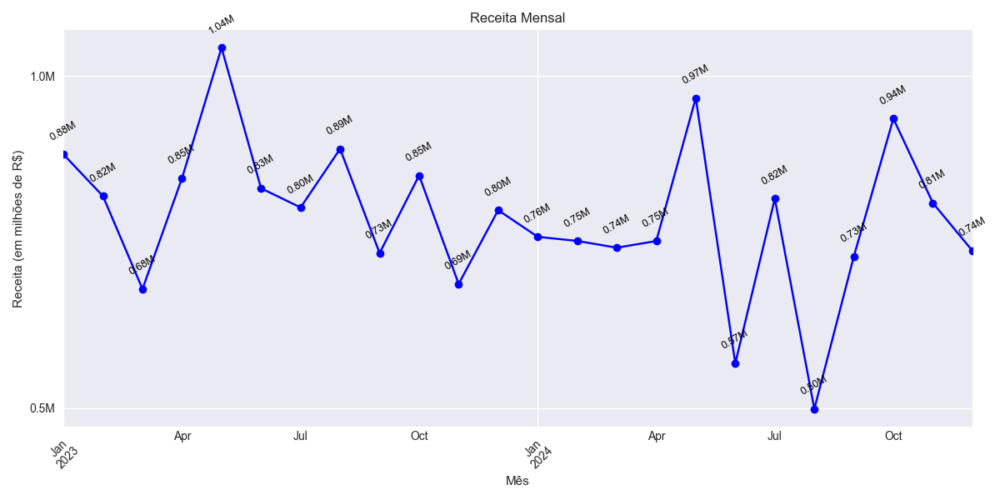
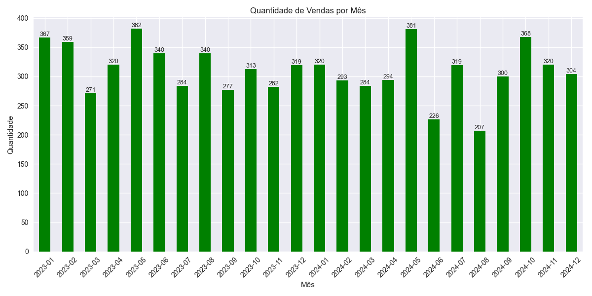
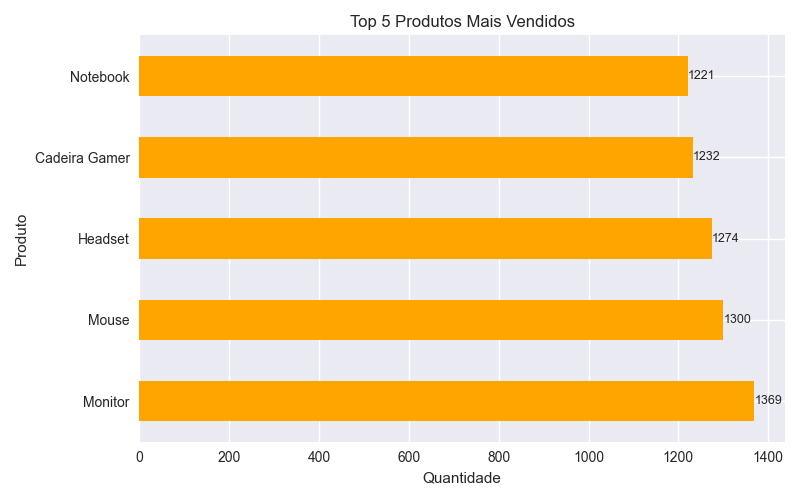
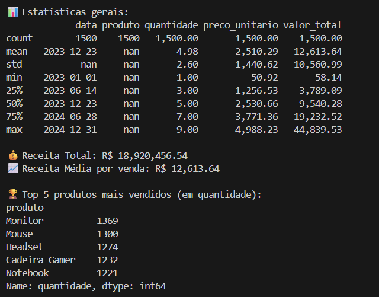

# 📊 Analisador de Vendas em Python

Este projeto foi criado para praticar **análise de dados em Python**, utilizando as bibliotecas `pandas` e `matplotlib`.  
Ele simula um cenário de vendas, mostrando como extrair insights de um dataset e gerar visualizações úteis.

## 🔧 Funcionalidades

- Leitura e tratamento de dados em CSV
- Estatísticas descritivas (faturamento total, média, top produtos)
- Análises temporais (tendência de vendas ao longo do tempo)
- Visualizações em gráficos (linhas, barras, pizza)

## 📂 Estrutura do Projeto

- 📂 analisador-vendas/
  - 📂 data/
    - 📄 vendas.csv → Dataset de exemplo
  - 📂 src/
    - 📄 analise.py → Script principal
  - 📄 README.md
  - 📄 requirements.txt
  - 📄 .gitignore


## 🚀 Como Rodar o Projeto

1. Clone este repositório:
   ```bash
   git clone https://github.com/seu-usuario/analisador_vendas.git

2. Entre na pasta do projeto:
   ```bash
   cd analisador-vendas
3. Crie um ambiente virtual (opcional, mas recomendado):
   ```bash
   python -m venv venv
   source venv/bin/activate  # Linux/Mac
   venv\Scripts\activate     # Windows

4. Instale as dependências:
   ```bash
   pip install -r requirements.txt

5. Rode o script:
   ```bash
   python src/analise.py

## 📊 Exemplo de Saída

### Gráfico da Receita Mensal



### Gráfico da Quantidade Mensal


### Gráfico do Top Produtos


## 📊 Terminal 



## 📚 Tecnologias Utilizadas

- Python

- Pandas

- Matplotlib

## 💡 Melhorias Futuras

1. Criar um dashboard interativo com Streamlit

2. Adicionar previsão de vendas usando Prophet ou scikit-learn

3. Permitir upload de novos datasets pelo usuário

## 👩‍💻 Autora

Desenvolvido por Francielli Valerio

🔗 [Meu LinkedIn](https://www.linkedin.com/in/franciellivalerio/)


